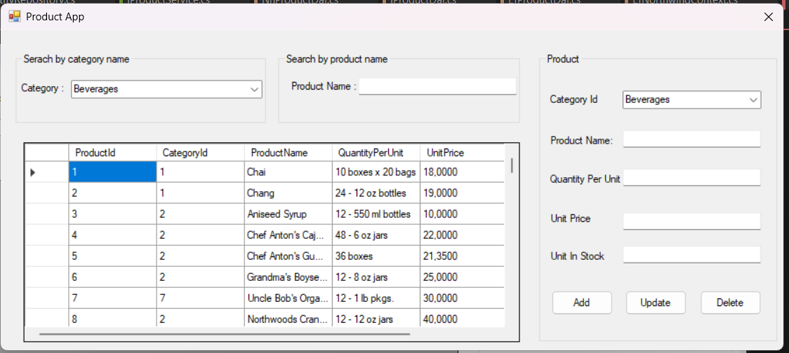
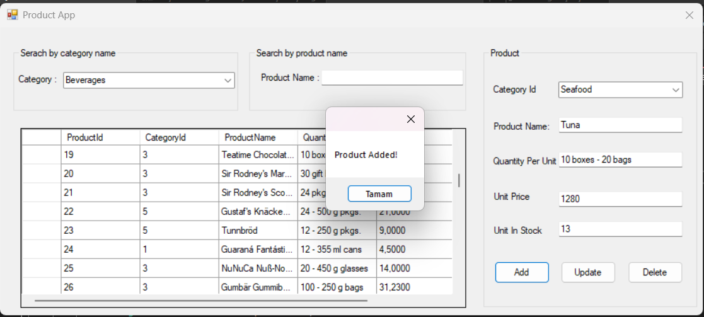
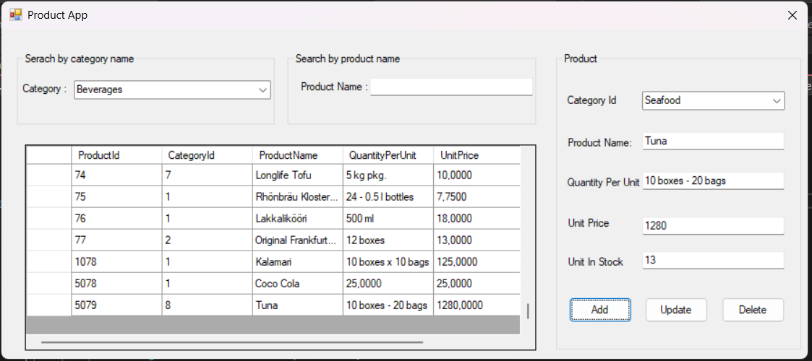
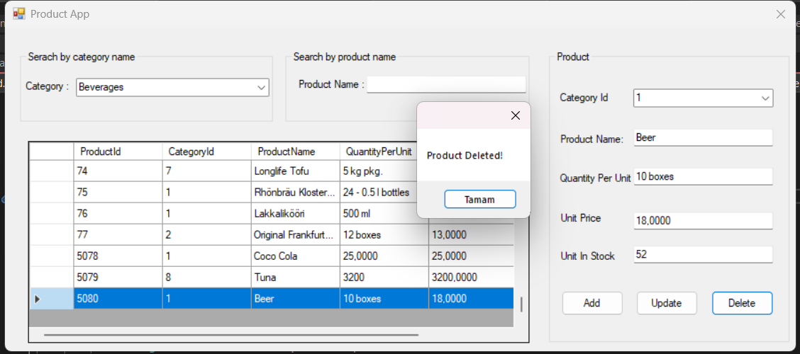
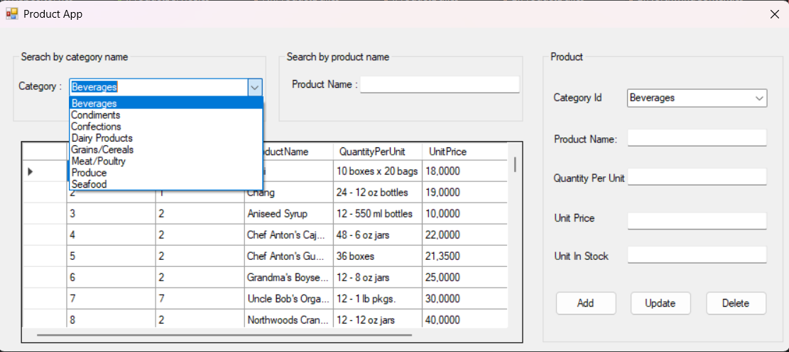
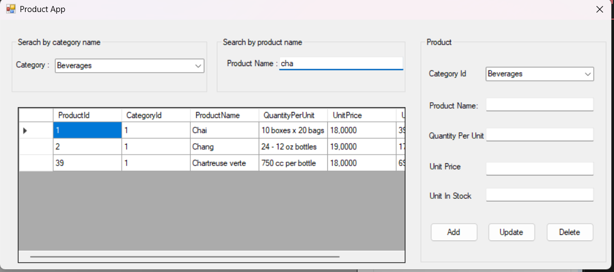

Layered Architecture Product App
A WinForms application built with Layered Architecture and Repository Pattern using Entity Framework 6.

🧠 Architecture

Entities Layer

Data Access Layer (Repository Pattern + Generic Repository)

Business Layer (Service Abstractions)

WinForms UI Layer

This project demonstrates clean architecture principles and constructor-based dependency injection in a .NET Framework environment.

🛠 Technologies Used

C#

.NET Framework

Entity Framework 6

SQL Server (LocalDB)

WinForms

Repository Pattern / Generic Repository

Dependency Injection (Constructor Injection)

⚙️ Features

List products

Filter products by category (ComboBox)

Search products by product name

Select product from grid to auto-fill fields

Add / Update / Delete product

🗄 Database

This project uses the Northwind sample database (SQL Server LocalDB).
Database file is not included in this repository.

📸 Screenshots

(Place your screenshots under docs/screenshots/)

Main UI: docs/screenshots/ProductApp.png

Add: docs/screenshots/Product-Add.png

Added: docs/screenshots/Product-Added.png

Update: docs/screenshots/Product-Update.png

Updated: docs/screenshots/Product-Updated.png

Delete: docs/screenshots/Product-Deleted.png

Search by category: docs/screenshots/Search by category name.png

Search by product: docs/screenshots/Search by product name.png

🙌 Notes / Credit

This project was developed as a guided practice based on Engin Demiroğ’s training.
I followed the course for the architecture/repository implementation and independently designed and built the WinForms UI (layout & interactions).

### Main Screen

### Add Product

### Product Added

### Update Product

### Product Updated

### Delete Product

### Search by Category

### Search by Product Name

----

Layered Architecture Product App
Katmanlı mimari ve Repository Pattern kullanılarak geliştirilmiş bir WinForms uygulamasıdır.

🧠 Mimari

Entities

DataAccess (Repository Pattern + Generic Repository)

Business (Service katmanı)

WinForms UI

Amaç, temiz kod prensiplerini ve constructor injection ile bağımlılık enjeksiyonunu uygulamalı olarak göstermektir.

🛠 Kullanılan Teknolojiler

C#

.NET Framework

Entity Framework 6

SQL Server (LocalDB)

WinForms

Repository Pattern / Generic Repository

Dependency Injection (Constructor Injection)

⚙️ Özellikler

Ürünleri listeleme

Kategoriye göre filtreleme (ComboBox)

Ürün adına göre arama

Grid’den ürün seçince alanların otomatik dolması

Ürün ekleme / güncelleme / silme

🗄 Veritabanı

Bu proje Northwind örnek veritabanını (SQL Server LocalDB) kullanır.
Veritabanı dosyası repoya dahil değildir.

📸 Ekran Görüntüleri

(Görselleri docs/screenshots/ altına koyabilirsiniz.)

🙌 Not / Kaynak

Bu proje, Engin Demiroğ eğitimindeki yönlendirmeli uygulama üzerinden geliştirilmiştir.
Katmanlı mimari/repository yapısını eğitim doğrultusunda uyguladım; WinForms arayüz tasarımını ve kullanıcı etkileşimlerini ise kendim geliştirdim.
